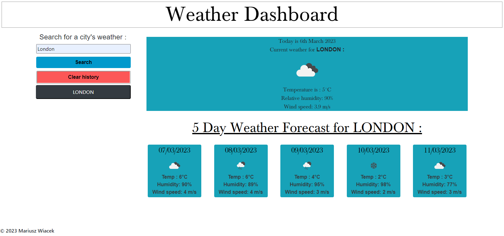

# Module 8 Server-Side APIs: Weather Dashboard

This weather dashboard app is to check current weather and 5 day forecast using the OpenWeatherMap APIs. 

In this App you are able to check weather for multiple cities and retrieve them later from local storage.

## Built With
* HTML
* CSS
* BootStrap
* jQuery
* Moment.js
* AJAX, API

## Site Location
[Work Day Scheduler](https://mariuszwiacek.github.io/Weather-Dashboard)

## Contribution
Made by Mariusz Wiacek

## Screenshot

### ©️2023 Mariusz Wiacek
